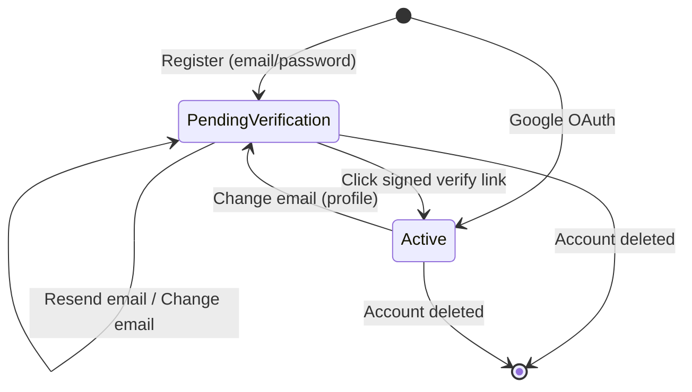
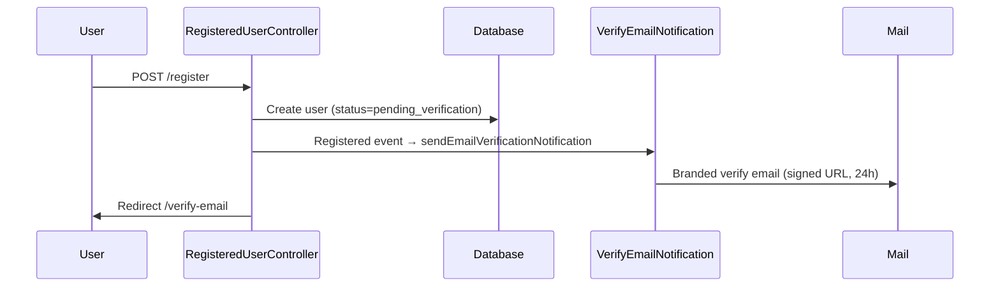
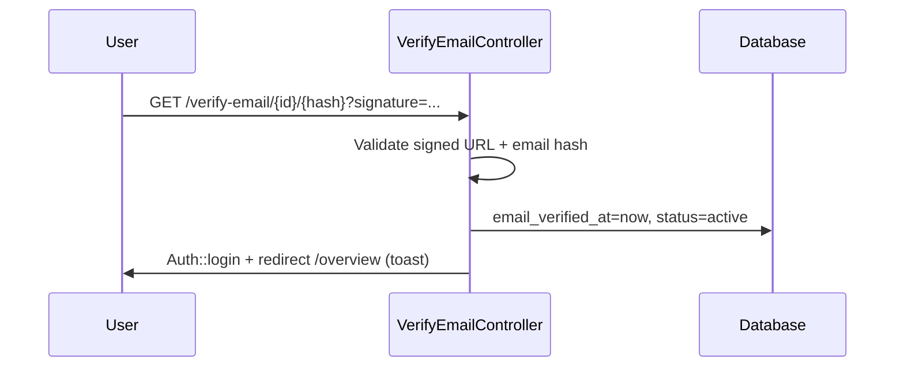

# CubSign Architecture

High-level architecture notes for major flows and state changes.

---

## Email Verification Flow

### State diagram

### Registration sequence

### Verification link click

### Access control

| Route group | Guest | Auth unverified | Auth verified |
|---|---|---|---|
| Public (`/`, `/pricing`) | ✅ | ✅ | ✅ |
| `/verify-email` | ❌ | ✅ | redirect overview |
| Workspace (`/overview`, `/documents`) | ❌ | redirect verify | ✅ |
| Sign flow (`/sign/*`) | ✅ | redirect verify | ✅ |
| Profile | ❌ | redirect verify | ✅ |
| JSON/API (future) | 401 | 403 Email Verification Required | ✅ |

### Services and components

| Component | Responsibility |
|---|---|
| `User` model | `MustVerifyEmail`, `UserStatus` enum, `markEmailAsVerified()` |
| `VerifyEmailNotification` | Signed URL generation, branded mail |
| `EnsureEmailIsVerified` | Middleware gate for workspace + JSON 403 |
| `EmailVerificationNotificationController` | Resend with 60s cooldown + 5/hour limit |
| `VerifyEmail.vue` | Verify screen UI with countdown |
| `VerificationExpired.vue` | Expired link recovery |

### Data flow — resend protection

1. User clicks **Resend** on `VerifyEmail.vue`
2. `POST /email/verification-notification`
3. Controller checks cache cooldown key (`verification-resend-cooldown:{userId}`)
4. Controller checks `RateLimiter` (`verification-resend:{userId}`, 5 attempts / 60 min)
5. On success: sends notification, sets cooldown cache (60s), increments rate limiter
6. Prompt controller passes `resendAvailableAt` seconds to Vue for countdown display

### Configuration

Defined in `config/auth.php` → `verification` array:

| Key | Default | Purpose |
|---|---|---|
| `expire` | 1440 min | Signed URL lifetime |
| `resend_cooldown` | 60 sec | Minimum gap between resends |
| `resend_limit` | 5 | Max resends per window |
| `resend_decay` | 60 min | Rate limit window |

Environment overrides: `AUTH_VERIFICATION_*` (see README).

### Invalid / expired signatures

`bootstrap/app.php` catches `InvalidSignatureException` on `verification.verify` and redirects to `verification.expired`.

---

## Related documentation

- [README.md](../README.md) — setup and routes
- [DEVELOPMENT_TRACKER.md](../DEVELOPMENT_TRACKER.md) — feature status
- [CHANGELOG.md](../CHANGELOG.md) — release notes
